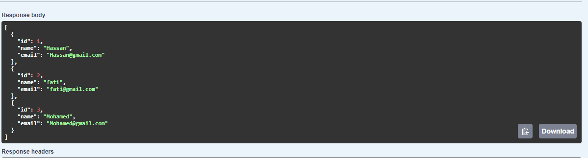
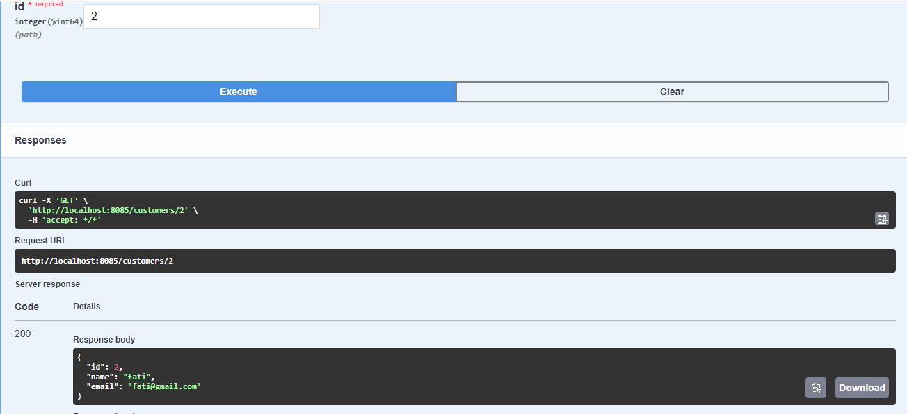
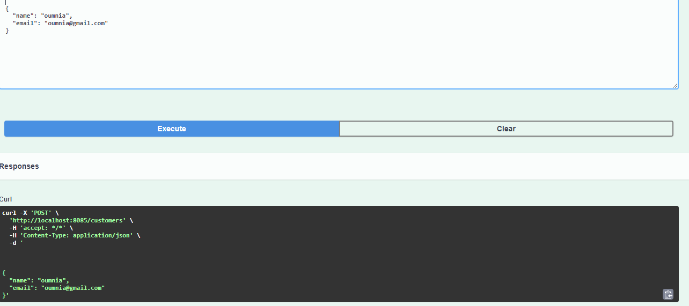
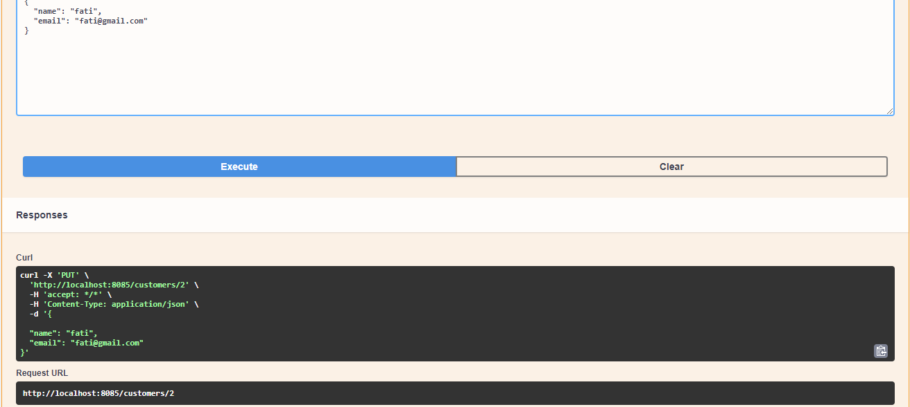
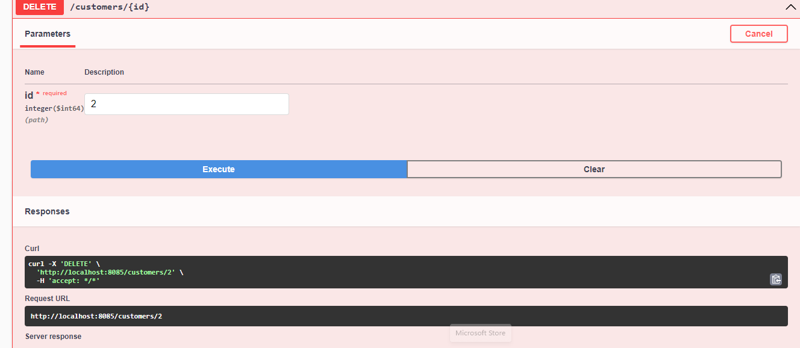
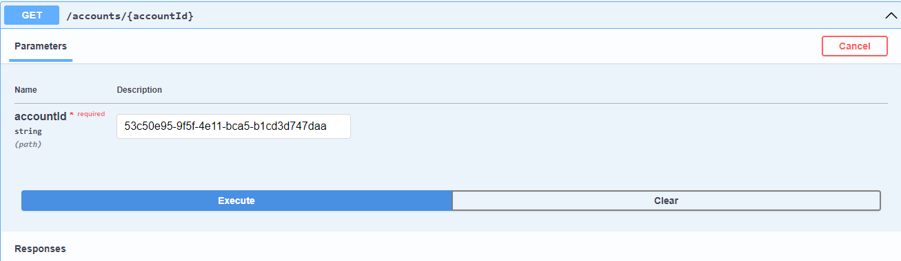
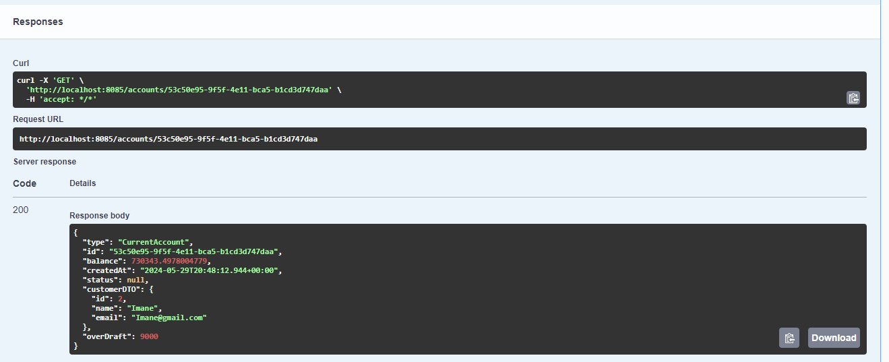
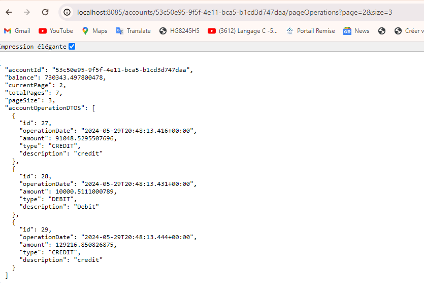

<h3>COMPTE RENDU PARTIE BACKEND</h3>
<h4>Liste Customers</h4>

<h4>Customer par ID</h4>

<h4>Ajouter un nouveau Customer</h4>

<h4>Modifier customer par ID</h4>

<h4>Supprimer Customer</h4>

<h4>Liste des Comptes</h4>

<h4>Compte par ID</h4>

<h4>Pagination </h4>

